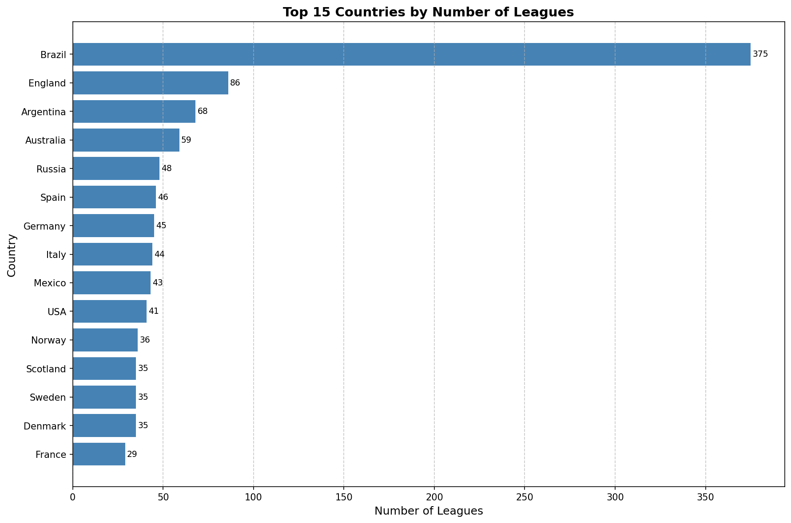
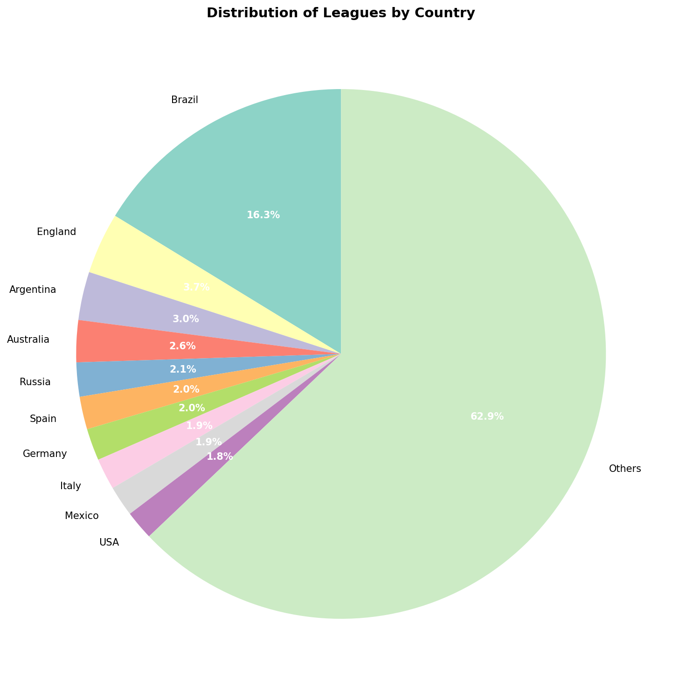

# Лабораторная работа №14: Разработка конвейеров обработки данных на Python и Go

**Студент:** Ражина Маргарита Александровна
**Группа:** 220032-11
**Вариант:** 18 - Сбор и анализ спортивной статистики (Сложность: средняя) 
Источник данных: API футбольных лиг 

## Описание проекта

Проект представляет собой полноценный конвейер сбора и анализа данных о футбольных лигах. Система собирает информацию из внешнего API футбольной статистики, обрабатывает данные с помощью Go и Python, сохраняет в формате Parquet и предоставляет инструменты анализа с использованием DuckDB, Polars и визуализации через Matplotlib.

## Архитектура конвейера

```
┌─────────────────┐     ┌──────────────┐     ┌─────────────────┐
│   API Stats     │────▶│ Go-сборщик   │────▶│ JSON Lines      │
│  (sstats.net)   │     │ (collector)  │     │ (leagues_raw)   │
└─────────────────┘     └──────────────┘     └─────────────────┘
                                                        │
                                                        ▼
┌─────────────────┐     ┌──────────────┐     ┌─────────────────┐
│  Визуализация   │◀────│  DuckDB      │◀────│    Parquet      │
│  (Matplotlib)   │     │  (SQL)       │     │ (leagues_clean) │
└─────────────────┘     └──────────────┘     └─────────────────┘
                                ▲
                                │
                        ┌──────────────┐
                        │   Polars     │
                        │ (очистка)    │
                        └──────────────┘
```

### Этапы конвейера

1. **Сбор данных (Go)** — `collector/` собирает данные о футбольных лигах через REST API с rate limiting и retry-логикой
2. **Сериализация** — данные сохраняются в формате JSON Lines (`leagues_raw.json`)
3. **Очистка (Polars)** — `clean.py` удаляет дубликаты, заполняет пропуски, приводит типы
4. **Сохранение** — очищенные данные записываются в `leagues_clean.parquet`
5. **Агрегация (Polars)** — группировка очищенных данных из `leagues_clean.parquet` через `aggregate.py`
6. **Анализ (DuckDB / Polars)** — SQL-запросы и сравнение производительности через `benchmark.py`
7. **Визуализация (Matplotlib)** — построение графиков через `visualize.py`

## Структура проекта

```
lab14/
├── .env.example              # Шаблон переменных окружения
├── .gitignore                # Исключения Git
├── PROMPT_LOG.md             # Лог запросов
├── README.md                 # Документация проекта
├── requirements.txt          # Python-зависимости
├── collector/                # Go-модуль: сбор данных
│   ├── go.mod                # Модуль Go
│   ├── main.go               # Точка входа
│   ├── config.go             # Загрузка конфигурации из .env
│   ├── client.go             # HTTP-клиент API с retry
│   ├── service.go            # Оркестрация сбора данных
│   ├── batch_writer.go       # Буферизированная запись
│   ├── writer.go             # JSON Lines writer
│   ├── models.go             # Структуры данных
│   ├── interfaces.go         # Интерфейсы
│   ├── leagues_raw.json      # Сырые данные (генерируется)
│   └── *_test.go             # Юнит-тесты Go
└── analytics/                # Python-модуль: анализ
    ├── clean.py              # Очистка данных
    ├── aggregate.py          # Агрегация данных
    ├── analyze.py            # Исследовательский анализ
    ├── benchmark.py          # Сравнение DuckDB vs Polars
    ├── visualize.py          # Построение графиков
    ├── leagues_clean.parquet # Очищенные данные (генерируется)
    ├── top_countries_bar.png # График: топ стран (генерируется)
    ├── league_distribution_pie.png # График: распределение (генерируется)
    ├── test_clean.py         # Тесты очистки
    ├── test_aggregate.py     # Тесты агрегации
    ├── test_analyze.py       # Тесты анализа
    └── test_benchmark.py     # Тесты DuckDB-запросов
```

## Переменные окружения

Создайте файл `.env` в корне проекта на основе `.env.example`:

```bash
SSTATS_API_KEY=your_api_key_here
SSTATS_BASE_URL=https://api.sstats.net
```

### Как получить API ключ

1. Перейдите на сайт [api.sstats.net](https://api.sstats.net)
2. Зарегистрируйтесь или войдите в личный кабинет
3. Перейдите в раздел "API Keys" или "Мои ключи"
4. Создайте новый ключ API
5. Скопируйте ключ в файл `.env` в переменную `SSTATS_API_KEY`

## Зависимости

### Go

- Go 1.21+
- Стандартная библиотека (нет внешних зависимостей)

### Python

```bash
pip install -r requirements.txt
```

Содержимое `requirements.txt`:

```
polars>=1.0.0
duckdb>=1.0.0
pytest>=8.0.0
matplotlib>=3.10.0
```

## Инструкция по запуску

### 1. Сбор данных (Go)

```bash
cd collector
go run .
```

Результат: файл `collector/leagues_raw.json` с сырыми данными.

### 2. Очистка данных (Python)

```bash
cd analytics
python clean.py
```

Результат: файл `analytics/leagues_clean.parquet` с очищенными данными.

### 3. Анализ данных

```bash
python analyze.py      # Общая информация о данных
python aggregate.py    # Агрегация по очищенному Parquet-файлу
```

### 4. Сравнение производительности

```bash
python benchmark.py
```

Выводит результат SQL-запроса через DuckDB, аналогичный запрос через Polars и сравнение времени выполнения.

### 5. Визуализация

```bash
python visualize.py
```

Генерирует два графика:
- `top_countries_bar.png` — горизонтальная столбчатая диаграмма топ-15 стран по количеству лиг
- `league_distribution_pie.png` — круговая диаграмма распределения лиг по странам

### 6. Запуск тестов

**Go:**
```bash
cd collector
go test ./...
```

**Python:**
```bash
cd analytics
pytest -v
```

## Примеры запросов

### DuckDB SQL-запрос

```sql
SELECT
    country.name AS country_name,
    COUNT(*) AS league_count,
    SUM(id) AS league_id_sum,
    AVG(id) AS league_id_avg,
    MIN(id) AS league_id_min,
    MAX(id) AS league_id_max
FROM 'analytics/leagues_clean.parquet'
WHERE country.name IS NOT NULL
GROUP BY country.name
HAVING COUNT(*) > 1
ORDER BY league_count DESC
```

### Polars-аналог

```python
import polars as pl

df = pl.read_parquet("analytics/leagues_clean.parquet")
result = (
    df.filter(pl.col("country").struct.field("name").is_not_null())
    .group_by(pl.col("country").struct.field("name").alias("country_name"))
    .agg(
        pl.col("id").count().alias("league_count"),
        pl.col("id").sum().alias("league_id_sum"),
        pl.col("id").mean().alias("league_id_avg"),
        pl.col("id").min().alias("league_id_min"),
        pl.col("id").max().alias("league_id_max"),
    )
    .filter(pl.col("league_count") > 1)
    .sort("league_count", descending=True)
)
```
## Примеры графиков

### Гистограмма: Топ-15 стран по количеству лиг

Горизонтальная столбчатая диаграмма показывает страны с наибольшим количеством футбольных лиг. Бразилия лидирует с ~375 лигами.



### Круговая диаграмма: Распределение лиг по странам

Диаграмма отображает долю лиг топ-10 стран от общего числа. Остальные страны объединены в категорию "Others".

